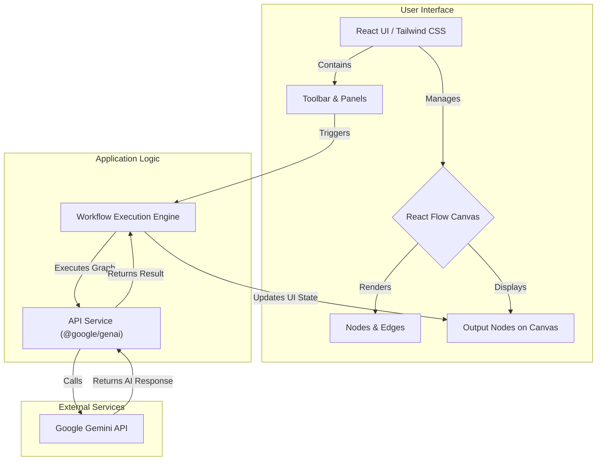

# AI Workflow Builder

An intuitive, web-based platform for designing, building, and running sophisticated AI-powered workflows using a simple drag-and-drop interface. Powered by the Google Gemini API.

*(Suggestion: Add a screenshot of the application in action here.)*

## ✨ Features

*   **Visual Canvas**: Intuitive drag-and-drop interface powered by React Flow.
*   **Rich Node Library**: A comprehensive set of nodes for input, AI processing, logic, and output.
*   **Real-time Configuration**: Instantly configure node parameters via a contextual side panel.
*   **Live Execution**: Run entire workflows with a single click and see results in real-time.
*   **Advanced Logic**: Implement conditional routing, data distribution, and input merging.
*   **Pre-built Templates**: Get started quickly with a variety of workflow templates.
*   **Save & Export**: Save progress (mock auth) and export workflows as JSON or PNG images.
*   **Undo/Redo**: Full history tracking for all your actions.
*   **Responsive Design**: Fully functional on both desktop and mobile devices.

## 🏛️ Architecture

The application is a client-side single-page application (SPA) built with React. It communicates directly with the Google Gemini API.



## 🛠️ Tech Stack

*   **Frontend**: React 19, TypeScript
*   **Canvas/Graph Library**: React Flow
*   **AI Integration**: Google Gemini API (`@google/genai`)
*   **Styling**: Tailwind CSS
*   **Build Tool**: Vite
*   **Icons**: Lucide React
*   **Notifications**: React Hot Toast

## 📂 Project Structure

The project follows a standard component-based architecture for modularity and maintainability.

```
/
├── public/                # Static assets
├── src/
│   ├── components/        # Reusable UI components
│   │   ├── nodes/         # Custom React Flow node components
│   │   ├── ui/            # Generic UI elements (Button, Dropdown)
│   │   └── ...            # Main layout components (Sidebar, Toolbar, etc.)
│   ├── services/          # Modules for external communication
│   │   ├── apiService.ts  # Logic for running workflows and calling Gemini API
│   │   └── helpChatService.ts # Mock service for the help chatbot
│   ├── utils/             # Utility functions (e.g., exporting)
│   ├── App.tsx            # Main application component
│   ├── constants.ts       # Node configurations and templates
│   ├── index.tsx          # Main entry point
│   └── types.ts           # TypeScript type definitions
├── .env.example           # Example environment variables file
├── index.html             # Main HTML file
├── package.json           # Project dependencies and scripts
└── vite.config.js         # Vite configuration
```

## 🚀 Getting Started

Follow these instructions to set up and run the project locally.

### Prerequisites

*   Node.js (v18 or later)
*   npm or yarn
*   A Google Gemini API Key. You can get one from [Google AI Studio](https://aistudio.google.com/app/apikey).

### Installation & Setup

1.  **Clone the repository:**
    ```bash
    git clone <repository-url>
    cd ai-workflow-builder
    ```

2.  **Install dependencies:**
    ```bash
    npm install
    ```

3.  **Set up environment variables:**
    Create a file named `.env` in the root of the project and add your Google Gemini API key. You can copy the example file:
    ```bash
    cp .env.example .env
    ```
    Then, edit the `.env` file:
    ```env
    # .env
    API_KEY="YOUR_GEMINI_API_KEY"
    ```
    > **Security Note:** This file should not be committed to source control.

4.  **Run the development server:**
    ```bash
    npm run dev
    ```

5.  Open your browser and navigate to `http://localhost:5173` (or the URL provided by Vite).

