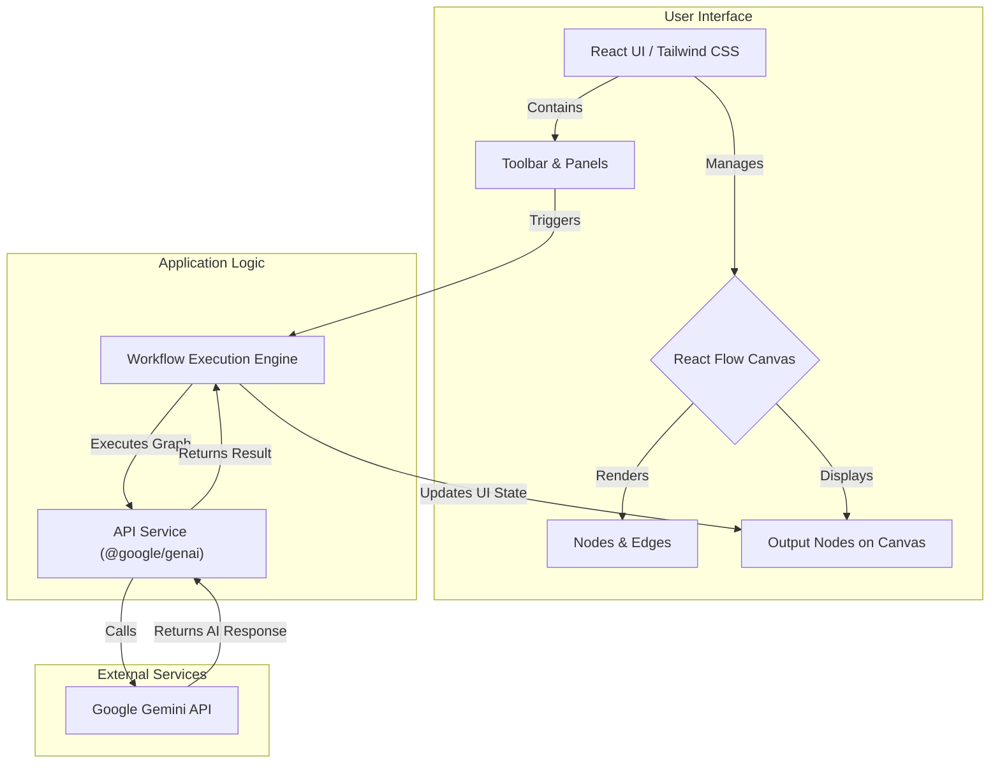

# AI Workflow Builder

An intuitive, web-based platform for designing, building, and running sophisticated AI-powered workflows using a simple drag-and-drop interface. Powered by the Google Gemini API.

*(Suggestion: Add a screenshot of the application in action here.)*

## ✨ Features

*   **Visual Canvas**: Intuitive drag-and-drop interface powered by React Flow.
*   **Rich Node Library**: A comprehensive set of nodes for input, AI processing, logic, and output.
*   **Real-time Configuration**: Instantly configure node parameters via a contextual side panel.
*   **Live Execution**: Run entire workflows with a single click and see results in real-time.
*   **Advanced Logic**: Implement conditional routing, data distribution, and input merging.
*   **Pre-built Templates**: Get started quickly with a variety of workflow templates.
*   **Save & Export**: Save progress (mock auth) and export workflows as JSON or PNG images.
*   **Undo/Redo**: Full history tracking for all your actions.
*   **Responsive Design**: Fully functional on both desktop and mobile devices.

## 🏛️ Architecture

The application is a client-side single-page application (SPA) built with React. It communicates directly with the Google Gemini API.



## 🛠️ Tech Stack

*   **Frontend**: React 19, TypeScript
*   **Canvas/Graph Library**: React Flow
*   **AI Integration**: Google Gemini API (`@google/genai`)
*   **Styling**: Tailwind CSS
*   **Build Tool**: Vite
*   **Icons**: Lucide React
*   **Notifications**: React Hot Toast

## 📂 Project Structure

The project follows a standard component-based architecture for modularity and maintainability.

```
/
├── public/                # Static assets
├── src/
│   ├── components/        # Reusable UI components
│   │   ├── nodes/         # Custom React Flow node components
│   │   ├── ui/            # Generic UI elements (Button, Dropdown)
│   │   └── ...            # Main layout components (Sidebar, Toolbar, etc.)
│   ├── services/          # Modules for external communication
│   │   ├── apiService.ts  # Logic for running workflows and calling Gemini API
│   │   └── helpChatService.ts # Mock service for the help chatbot
│   ├── utils/             # Utility functions (e.g., exporting)
│   ├── App.tsx            # Main application component
│   ├── constants.ts       # Node configurations and templates
│   ├── index.tsx          # Main entry point
│   └── types.ts           # TypeScript type definitions
├── .env.example           # Example environment variables file
├── index.html             # Main HTML file
├── package.json           # Project dependencies and scripts
└── vite.config.js         # Vite configuration
```

## 🚀 Getting Started

Follow these instructions to set up and run the project locally.

### Prerequisites

*   Node.js (v18 or later)
*   npm or yarn
*   A Google Gemini API Key. You can get one from [Google AI Studio](https://aistudio.google.com/app/apikey).

### Installation & Setup

1.  **Clone the repository:**
    ```bash
    git clone <repository-url>
    cd ai-workflow-builder
    ```

2.  **Install dependencies:**
    ```bash
    npm install
    ```

3.  **Set up environment variables:**
    Create a file named `.env` in the root of the project and add your Google Gemini API key. You can copy the example file:
    ```bash
    cp .env.example .env
    ```
    Then, edit the `.env` file:
    ```env
    # .env
    API_KEY="YOUR_GEMINI_API_KEY"
    ```
    > **Security Note:** This file should not be committed to source control.

4.  **Run the development server:**
    ```bash
    npm run dev
    ```

5.  Open your browser and navigate to `http://localhost:5173` (or the URL provided by Vite).

## 🎬 Video Demo Script

Here is a script for a ~75-second promotional video:

**(0-5s) Intro Animation**
*   **Visual:** Sleek animation of the app's name: "AI Workflow Builder". Fades into a clean, empty canvas view of the application.
*   **Audio:** Upbeat, modern background music starts.
*   **VO:** "Ready to bring your AI ideas to life, visually? Welcome to the AI Workflow Builder."

**(5-25s) Building a Basic Workflow**
*   **Visual:**
    *   Cursor drags a "User Query" node from the left sidebar onto the canvas.
    *   Cursor drags an "LLM Engine" node.
    *   Cursor drags an "Output" node.
    *   Cursor quickly connects them: User Query -> LLM Engine -> Output.
*   **Audio:** (Satisfying "click" sounds as nodes connect)
*   **VO:** "Building a workflow is as simple as drag and drop. Start with an input, add an AI processing engine, and finish with an output. Connect them to create the flow of data."

**(25-40s) Configuration**
*   **Visual:**
    *   Cursor clicks the "User Query" node. The right-hand configuration panel opens.
    *   The user types a new query: "What are the three most popular dog breeds?"
    *   Cursor clicks the "LLM Engine" node. The panel updates.
    *   The "Use Web Search" toggle is clicked to 'On'. The change is visible on the node itself.
*   **Audio:** (Keyboard typing sounds)
*   **VO:** "Each node is fully configurable. Click a node to open the settings panel. Change the user query, select your AI model, or enable features like web search for up-to-the-minute answers."

**(40-55s) Running & Results**
*   **Visual:**
    *   Cursor moves to the top toolbar and clicks the "Run" button.
    *   The nodes on the canvas light up sequentially as the workflow executes.
    *   The "Output" node, which was empty, populates with the user's question and then the AI's generated answer. The view scrolls to show the full answer.
*   **Audio:** (A "whoosh" sound as the workflow runs, music swells)
*   **VO:** "When you're ready, hit 'Run'. The builder executes each step in order, feeding the output of one node into the next, until the final result appears right on your canvas."

**(55-65s) Exploring Templates & Exporting**
*   **Visual:**
    *   Quick montage: Cursor clicks the templates dropdown, selects "Creative Story & Image". The canvas instantly populates with a more complex workflow.
    *   Cursor clicks a button in the toolbar and a `workflow.png` file is shown downloading.
*   **Audio:** (Music becomes more inspiring)
*   **VO:** "Get a head start with pre-built templates for common tasks, from document analysis to image generation. When you're done, export your entire workflow as a JSON file or a PNG image to share your creation."

**(65-75s) Outro**
*   **Visual:** Fades to a clean screen with the app logo and a call to action.
*   **Audio:** (Music fades out with a final chord)
*   **VO:** "The AI Workflow Builder. Your vision, automated. Start building today."
